# Customizing display firmware for DWIN LCDs

This README explains how to add custom display firmware to printers (usually Creality or Creality clones) with DWIN LCDs, as well as the files to easily add AWCY? skins. If you are a DWIN LCD pleb, this document is for you. If you are instead a patrician pixel screen enjoyer, go visit [our sister project here](https://gitlab.com/capekoviroboti/awcy-custom-bootscreen) which has the documentation and `.h` files for compiling Marlin with customized bootscreens.

A quick word of caution: this project is still in alpha. Lots of things may take effort to get working, especially on Windows which has had much less testing.

## Table of Contents:

* [Customizing display firmware for DWIN LCDs](#customizing-display-firmware-for-dwin-lcds)
   * [DWIN LCD printers](#dwin-lcd-printers)
      * [Helping us out](#helping-us-out)
   * [Installing a prepackaged bundle](#installing-a-prepackaged-bundle)
   * [<strong><em>EXTREME TL;DR</em></strong>](#extreme-tldr)
   * [Prerequisites](#prerequisites)
      * [Prerequisite 1: Python 3](#prerequisite-1-python-3)
         * [Testing your Python 3 installation](#testing-your-python-3-installation)
         * [Installing required Python packages:](#installing-required-python-packages)
      * [Prerequisite 2: A working Marlin build](#prerequisite-2-a-working-marlin-build)
   * [Building the DWIN_SET folder](#building-the-dwin_set-folder)
      * [Compiling mainboard firmware though the wizard](#compiling-mainboard-firmware-though-the-wizard)
   * [Flashing the DWIN_SET folder to your SD card](#flashing-the-dwin_set-folder-to-your-sd-card)
      * [Troubleshooting flashing problems](#troubleshooting-flashing-problems)
   * [Other build tools](#other-build-tools)
      * [Photo requirements](#photo-requirements)
         * [Troubleshooting image problems](#troubleshooting-image-problems)
      * [Building a custom bootscreen](#building-a-custom-bootscreen)
      * [Building custom .ICO icons](#building-custom-ico-icons)
         * [Linux/macOS/WSL](#linuxmacoswsl)
         * [Windows](#windows)
      * [Troubleshooting .ICO problems](#troubleshooting-ico-icon-problems)
      * [.icl files](#icl-files)
      * [.bmp files](#bmp-files)
      * [.WAV files](#wav-files)
      * [Font .HZK tools](#font-hzk-tools)
      * [.BIN/.CFG files](#bin-files)
         * [Class 1 (T5UIC1 screens)](#class-1-t5uic1-screens)
         * [Class 2 (T5L screens)](#class-2-t5l-screens)
         * [Class 3 (T5UID1 screens)](#class-3-t5uid1-screens)

## DWIN LCD printers

There are a number of printers which have DWIN LCDs, including (but not limited to):

* Creality Ender-3 V2
* Creality Ender 3 Max
* Creality Ender 5 (newer models)
* Creality Ender 5+
* Creality Ender 5 Pro
* Creality Ender 6
* Creality CR10S Pro
* Creality CR10S Pro V2
* Creality CR10 Max
* Creality CR-X / Pro
* Creality CR10 V2/V3
* Creality CR20 and Pro
* Creality CR10S
* Creality CR10S4 400mm
* Creality CR10S5 500mm
* Creality CR6 / Max
* Voxelab Aquila
* Voxelab Aquila X2

#### Helping us out
We are still attempting to test as many of these printers as possible, so if you'd like to test out a printer we haven't tried out, that would be appreciated.
Just test out the build and flash it onto your machine. If there are issues, please open an issue on this project. If it succeeds, it would be much appreciated if you could send me a message saying that it worked; you can email me at `<the user who own this repository> <at> pm.me`, dm me on Matrix (same username - `capekoviroboti`) or ping me in the waiting room of AWCY?'s Matrix space [here](https://matrix.to/#/#AWCYwaitingroom:matrix.org).

The printers we have successfully tested so far are:

* Creality Ender-3 V2 - testing by invaderzip_
* Voxelab Aquila X2   - testing by trophytrout

**These printers have known issues:**

* CR6 / CR6 Max - We have no ability to compile icons or bootscreens for CR6 screens. This is under active investigation. If you are on Windows you can check out using [this firmware](https://github.com/CR6Community/CR-6-touchscreen), which includes some instructions on customizing your icons.

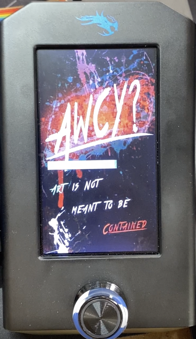

## Installing a prepackaged bundle
We have taken the time to package up a few versions of the built `DWIN_SET` directory, which are contained in the [package registry page](https://gitlab.com/capekoviroboti/creality-dwin-lcd-customizer/-/packages). You can install these by following the directions in the [flashing section below](#flashing-the-dwin_set-folder-to-your-sd-card).

We would recommend that you have a successful flash of pre-existing display firmware before you attempt using these files, so that you can roll back to something that works very easily.

If you have any problems with these files, please reach out to `capekoviroboti` in the [AWCY waiting room](https://matrix.to/#/#AWCYwaitingroom:matrix.org).

## **_EXTREME WIZARD TL;DR_**
Are you a fan of blindly rushing into things without understanding how or why anything works? This section of the document is for you!

Run the wizard from the command line using Python 3, within the `src` directory:

```sh
# Install the dependencies:
pip3 install -r requirements.txt
python3 creality_dwin_lcd_customizer.py
```

Select your printer from the drop down menu. Then fill in any fields you want to customize, or leave everything blank for the AWCY? presets for your printer. Press `Run`.

Once the app completes successfully, copy of the resulting `DWIN_SET` directory onto an SD card (which must be `FAT32` formatted with a 4096 byte/4K cluster size).
Eject the SD card and insert it into your display (with the machine powered off).
Power the machine back on; the screen should flash blue and then orange.
After it has flashed orange, power off the machine and remove the SD card.
Then power the machine back on; it should now be running your customized display firmware.

#### But wait, something went terribly wrong!
Well, unfortunately, you are probably going to have to read this enormous document I wrote to figure out how to fix it.

## Prerequisites
This section covers what you need before you can start using the tools contained in this repository.

### Prerequisite 1: Python 3

You will need a copy of Python 3 installed on your machine to make use of (1) the customizer wizard, (2) the font `.HZK` and icon `.ICO` parsing scripts, and (3) PlatformIO for compiling Marlin. On macOS and Linux Python 3 is installed by default, but on Windows you will need to install Python yourself. PlatformIO has a good guide on how to install Python 3 [here](https://docs.platformio.org/en/stable//faq.html#install-python-interpreter).

NOTE: there is currently [a bug](https://github.com/chriskiehl/Gooey/issues/669) in the Windows version of `wxpython`, which is a dependency of Gooey, the library we use to display the wizard. This bug results in you needing to have a MSVC compiler when installing Gooey via `pip` on Python 3.8 or later. If you want to avoid this issue, you can install Python 3.7 instead of the latest Python.

#### Testing your Python 3 installation

If you can run Python 3 from the command line, then you can proceed. Open a terminal:

* Windows - `Win` + `R`, then type `powershell` and press `Enter`
* Linux - `Ctrl` + `Alt` + `Tab`
* macOS - Search for the `Terminal` application in `Finder`.

Now run `python3 --version`. If you see a message like this, everything is working:

```
Python 3.9.7
```

#### Installing required Python packages:

Next, you will need to install the Python 3 packages that are used in the scripts. You can find them in `src/requirements.txt`:

* A recent version of [Gooey](https://github.com/chriskiehl/Gooey), used to draw the graphical user interface.
* A recent version of [Pillow](https://github.com/python-pillow/Pillow), an implementation of the Python image processing library.

To install them, use the Python package manager `pip` from within the `src` directory:

```
pip3 install -r requirements.txt
```

You can test whether they installed correctly by running a `python3` interpreter and trying to import them. In a terminal, type `python3` and press enter to start the interpreter. You should see something like this:

```
Python 3.9.7 (default, Sep  3 2021, 04:31:11)
[Clang 12.0.5 (clang-1205.0.22.9)] on darwin
Type "help", "copyright", "credits" or "license" for more information.
>>>
```

Next type in `import gooey` and press enter. If there are no errors, Gooey is installed correctly. Then try `import PIL`. Again, if there are no errors Pillow is installed correctly.

```
>>> import gooey
>>> import PIL
>>>
```

### Prerequisite 2: A working Marlin build

These instructions assume you already have a working build of Marlin set up. Most often, this is done using [VSCode](https://code.visualstudio.com) + [PlatformIO](https://platformio.org) + [Auto Build Marlin](https://marlinfw.org/docs/basics/auto_build_marlin.html). If you don't have a working Marlin build, it is highly recommended that you first successfully set that up and get some firmware that you compiled working on your printer before you attempt customizing your display. There are a lot of guides available that cover how to do this, so search for one that covers your specific printer, eg [this one for the Ender 3v2 + BLTouch](https://www.mironv.com/2020/08/14/ender3v2-bltouch-marlin/). This ensures that if something goes wrong, you know that you will be able to put your printer back into a working state by recompiling and reflashing.

If you need some help getting set up, Marlin has a [guide covering how to install Platformio](https://marlinfw.org/docs/basics/install_platformio.html) and a [guide covering how to install Auto Build Marlin on VSCode](https://marlinfw.org/docs/basics/install_platformio_vscode.html).
If you want an alternative to using VSCode, you can check out [this guide on Reddit](https://www.reddit.com/r/ender3v2/comments/k9v8oc/compilingbuilding_marlin_firmware_in_windows_with/), but using VSCode is easier.

#### NOTE:
On printers with DWIN LCDs, flashing the display firmware happens independently of flashing the mainboard firmware, but both are tightly linked. If your display firmware and mainboard firmware are out of sync with each other, the display will not work correctly.

As such, unless you know what you are doing, we recommend that you flash both at the same time.

## Building the `DWIN_SET` folder
The DWIN LCD supports full photos for the bootscreen, as well as custom icons. We will cover handling both of these in their own sections below.

The documentation below goes into significant detail on how you can create each of the file types used to customize the display firmware. However, if you would like to start testing with some of the included files, it is very simple.

Use `python3` from the command line to run the customizer wizard:

```sh
python3 creality_dwin_lcd_customizer.py
```

Running that script will bring up a window, like the one below:
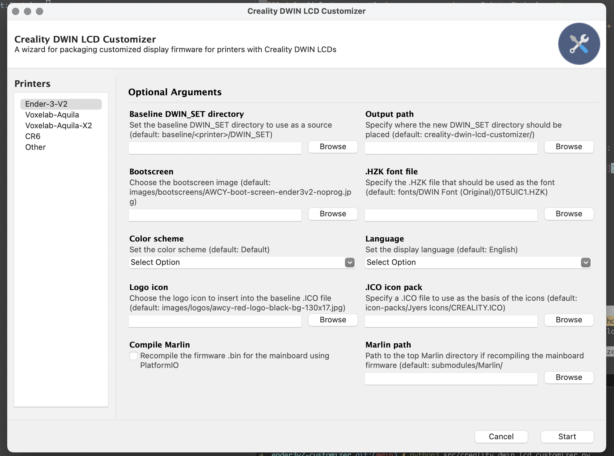

Select your printer from the menu on the left. Then fill in any fields you want to customize, or leave everything blank for the AWCY? presets for your printer. Press `Start`.

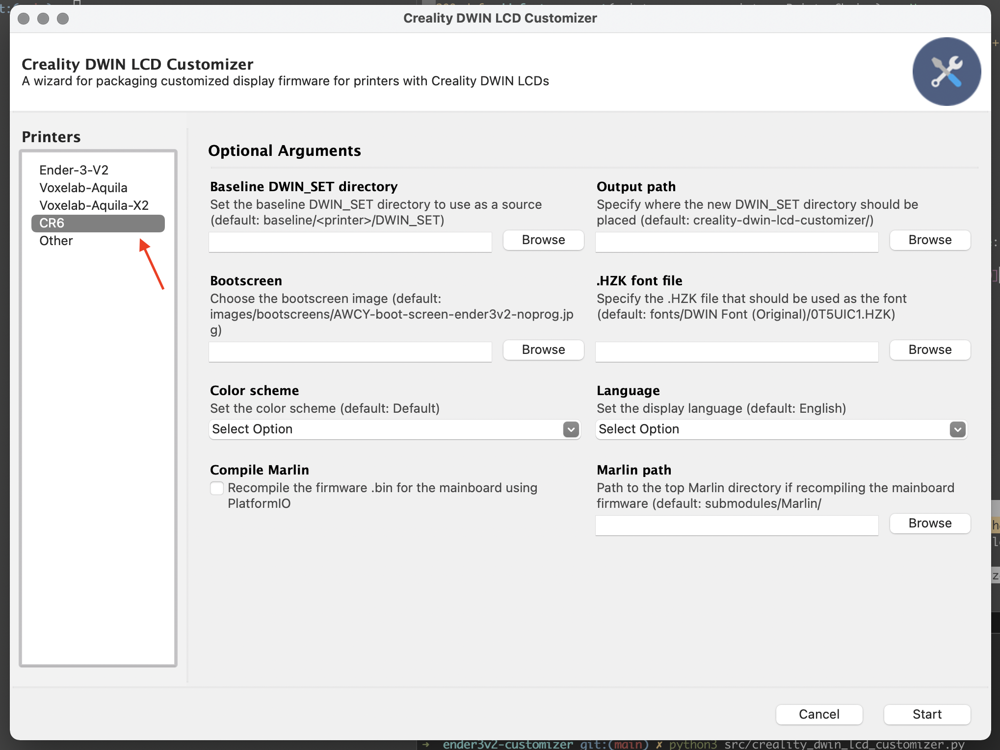


TODO: Continue writing this section.

Once the program has finished successfully, you should see a pop-up like this:

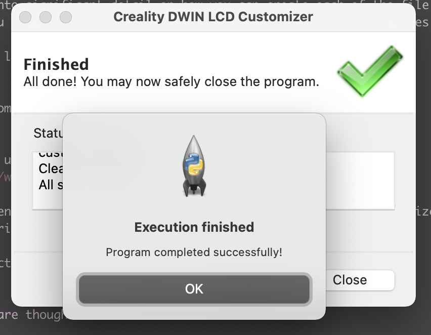


#### Compiling mainboard firmware though the wizard

To compile Marlin through the wizard, you need to set the options seen in the picture below:
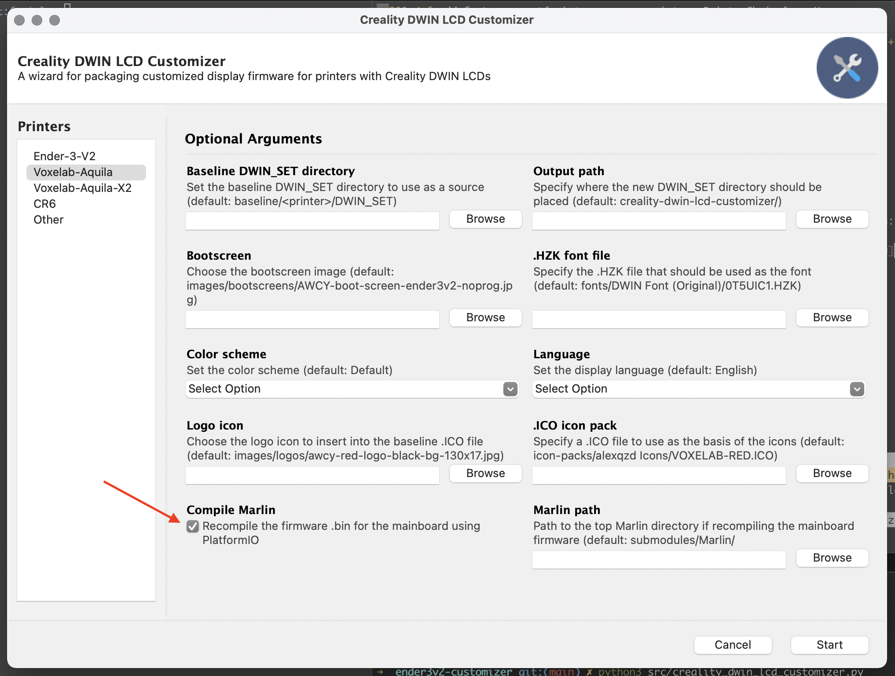
The Marlin path should be updated to use whatever Marlin directory you want to use as your base.

After you kick off the script with the `compile_mainboard` option on, the wizard will call Platformio to build Marlin.
If the build completes successfully, you will see a popup informing you that everything has finished:
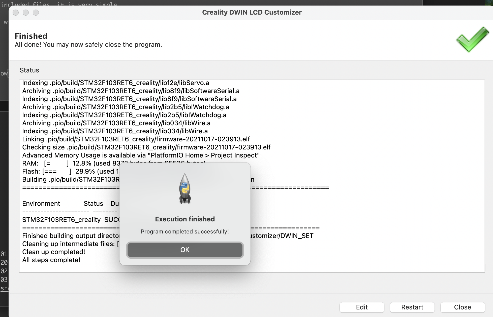

Note that if you change the `Language` or `Color Scheme` options from the default, for it to have any effect you will need to recompile using the `compile_mainboard` option:

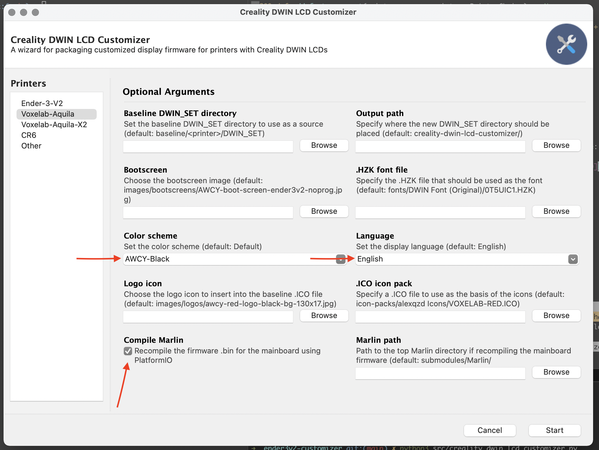

## Flashing the `DWIN_SET` folder to your SD card

Insert the SD card into your computer. Make sure that it is formatted as `FAT32` and the cluster size/allocation size is 4096 bytes/4K; if it is not, you will need to format it which will nuke everything on it!

If you are using the enclosed `AWCY/DWIN_SET` folder, there is nothing more for you to do. Otherwise, you will need to make sure you have copied over all the `.ICO` and `.jpg` files that you want to replace. See the section on building the `DWIN_SET` folder below for more info.

Next, copy over the `DWIN_SET` folder to the SD card. Once complete, eject the SD card from the computer and insert it into the microSD slot on the back of the LCD display. Turn on the printer. The screen should change first to blue and then after a bit to orange. Power off the machine again, then remove the SD card from the LCD. Power on the machine; if everything was successful, you should see your custom bootscreen!

#### Troubleshooting flashing problems

If flashing is not working make sure that the SD card is formatted correctly: `FAT32` filesystem, with 4096 byte allocation size. Symptoms of flashing errors:
    * The blue screen flashes very briefly before the orange screen appears, or doesn't seem to appear at all.
    * The screen boots to black and doesn't respond.

## Other build tools

This next session covers the nitty gritty of "super" customizing `DWIN_SET` directories; it will cover how to produce each of the file types that are needed a build. To discuss this, we will break the printers into 3 classes:

* Class 1 - Creality Ender 3 V2 and Ender 3 V2 clones (like the Voxelab Aquila) - T5UIC1 screens
* Class 2 - Creality CR6 - T5L screens
* Class 3 - All other Creality printers with DWIN LCDs - T5UID1 screens

The files used between the firmware for each class can be quite different.
The file types used in `DWIN_SET` directories are:

* `.ICO` icon packs - used to store icons on Class 1 printers.
    * Confusingly there are also `.ICO` images used as individual icons on Class 3 printers. These cannot be used interchangeably.
* `.jpg/.jpeg` images - used for the bootscreen and language files on Class 1 printers.
* `.HZK` font files - used to store fonts on all printers.
* `.icl` image/icon packs - used for storing images on Class 2 printers.
* `.bmp` images - Used by Class 3 printers to store the images including the bootscreen and icons.
* `.WAV` sound files - used to store sound clips on Class 3 printers.
* `.bin/.BIN/.CFG` binary files used to store firmware binaries and firmware configurations on all printers.

### Photo requirements
Before you convert an image into the final format that will go into the `DWIN_SET`, you should follow these instructions for creating stripped down JPEGs to start from.

This is because Marlin's DWIN LCD code is extremely picky about what types of photos it will display correctly; the most barebones JPEGs have the highest chance of working correctly.

1. Do not include a color profile.
2. Do not include EXIF, XMP or IPTC data.
3. **DO NOT USE** "progressive" JPEGs - this will _always_ cause the photo to behave improperly.
4. Increase the compression until the file is reduced to about the same size as the image you are trying to replace. If the file is too big, you may run in to problems with the memory.
5. Make sure the pixel dimensions are in identical order with the image they are replacing (120 x 40 is NOT the same as 40 x 120), and the file is in the same orientation.

The JPEG algorithm built in to Marlin will only accept baseline (ie non-progressive JPEGs); if you use a progressive JPEG, it may display a photo partially, with the rest appearing as static or it may not display at all.

In powerful photo editing software like Gimp and Photoshop, in the export JPEG window you should be able to specify all of this manually. But one easy way to ensure that you get a barebones JPEG file is to open it in an extremely barebones photo editor like Paint, and then save the file again. This should ensure that most of the complex options are stripped away.

If you are exporting the JPEG in Gimp, it should look like this:

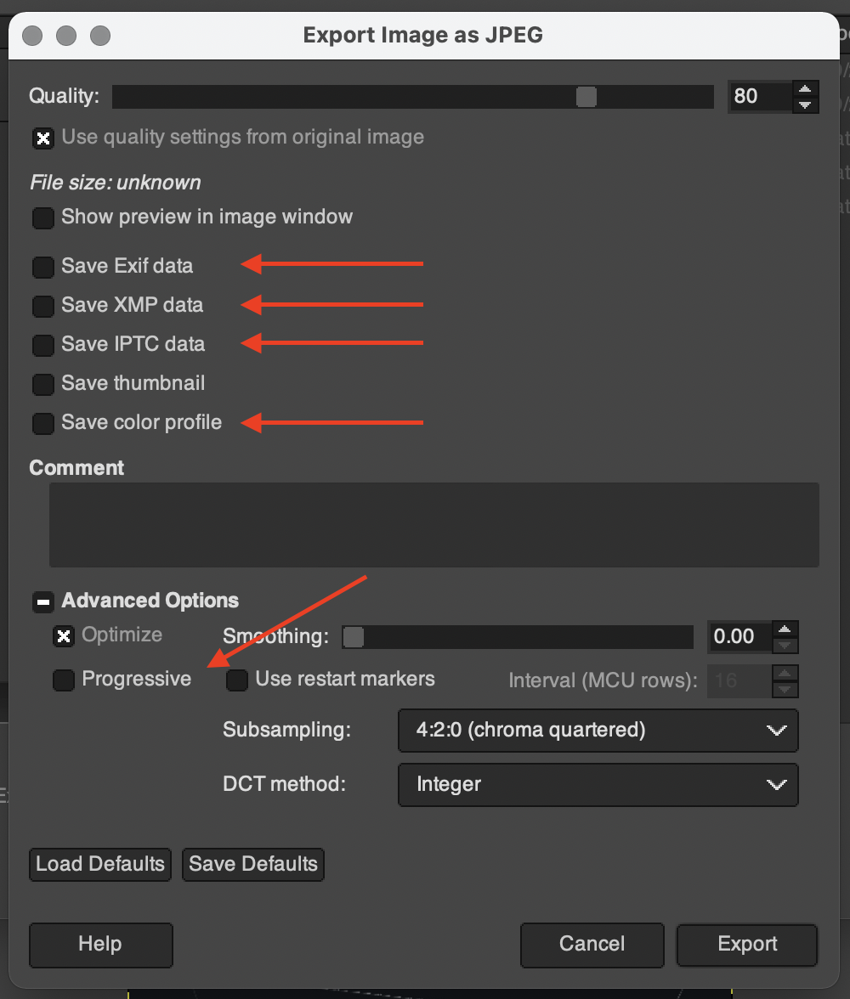

Note that "Progressive", color profiles, and EXIF/XMP/IPTC data are all unchecked.

#### Troubleshooting image problems
This section contains some images of what errors might look like in order to help you determine what is or is not working.

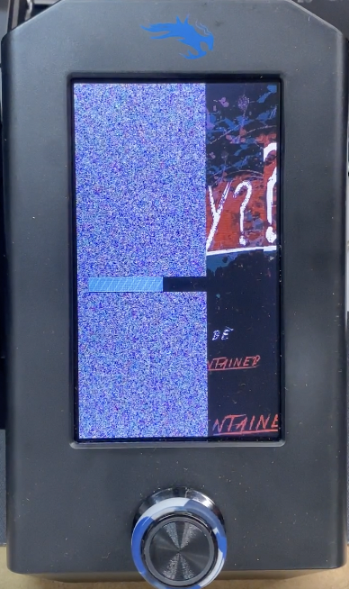

This first image is of the static issue mentioned in the previous section, as it applies to the bootscreen image.

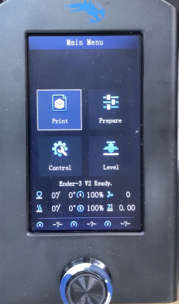

This second problematic image shows a missing logo. When the `.ICO` files is working and the icon is correctly loaded, it should look like this instead:

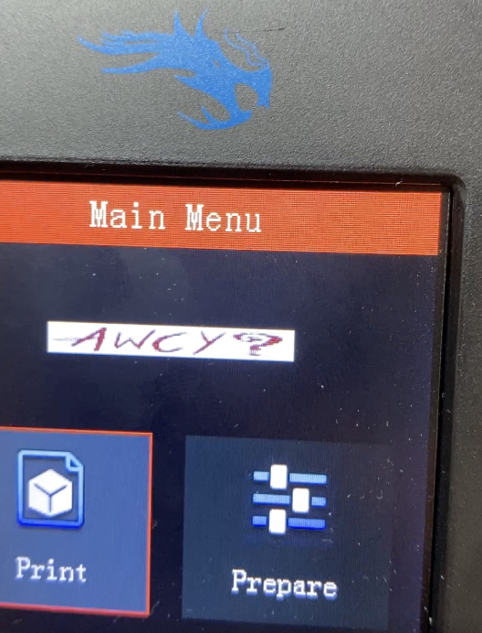

### Building a custom bootscreen

This is initially the file labeled `0_start.jpg`. As you can see from looking at it, it is exactly 480 x 272 and rotated 90 degrees counterclockwise. We will need our custom bootscreen to match. Making sure our JPEG file is about the same size (13.8kb), and matches all of the requirements described above, copy it into the `DWIN_SET` directory in place of `0_start.jpg`.

If the file is too big, try increasing the JPEG compression or using a less complex base photo.

### Building custom .ICO icons

The DWIN LCD code uses a non-standard version of `.ico` files to store icons. This is essentially a bundled directory containing a header which stores offsets to each icon, and then a series of labeled icons. We can change arbitrary icons in the `.ICO` file(s), once we decompile them. To do that, we can make use of [this tool](https://github.com/b-pub/dwin-ico-tools).

Download its prerequisite packages with the following command:

```bash
pip3 install pillow
```

The tool itself is included in the `submodules/dwin-ico-tools` directory.

Once you have the tool set up, you can decompile a `.ICO` file, named `9.ICO` in this example, like this:
```bash
# Change the order here for Windows
python3 dwin-ico-tools/splitIco.py DWIN_SET/9.ICO 9
```

Now the current folder will contain a new folder called `9` which contains each of the icons. We can now insert whatever icons we want to replace into that folder, matching the name, dimensions and orientation exactly and the size approximately.

Once you have added your new icons, we can recompile the `.ICO` file with the following command:

```bash
## Back up the old file
mv DWIN_SET/9.ICO DWIN_SET/9.ICO.bak
python3 dwin-ico-tools/makeIco.py 9 DWIN_SET/9.ICO
```

In this repository, we have included a script that will automatically compile new `.ICO` files of your choice using the AWCY logo to replace the Creality logo.

#### Linux/macOS/WSL

On Linux/macOS (or any platform which can run bash scripts), you can run that script like so:

```bash
## For Marlin v1:
./compile_dwin_ico_files.sh -v "1" -i input-ico-files -o output -c
## For Marlin v2:
./compile_dwin_ico_files.sh -v "2" -i input-ico-files -o output -c
```

This will use the included icons, and copy them into the `output` folder.

If you instead want to use icons that you created, you can check the `images/logos/` directory for what sizes you will need and what to name them. Then copy your new image files into the `input-ico-files` directory, and then call the script without the `-c` flag.

```bash
## For Marlin v1:
./compile_dwin_ico_files.sh -v "1" -i input-ico-files -o output
## For Marlin v2:
./compile_dwin_ico_files.sh -v "2" -i input-ico-files -o output
```

Your output files will be generated in whatever folder name you specified after `-o`, so in this example the `output` directory.

#### Windows

There is no Windows version of this tool yet, but we are working on one.

### Troubleshooting `.ICO` icon problems

If you are hitting issues with your icons, eg not showing up at all, or appearing as static, check the section of this document labeled "Photo requirements".

### `.icl` files

These are specific icons converted from JPEGs, which are described in the documentation as "a JPEG ICO file format in DGUS3 format".

* All start with `DGUS_3`, `0x44 0x47 0x55 0x53 0x5f 0x33`, then section of mostly zeros.
* From the documentation: "the size of a single JPG image file should not exceed 252KB". "4-12MB picture space can save ICL files of background picture library and ICL files of icon library. The file ID is from 16 to 63."

TODO: We are investigating how these files work mechanically; for the time being, we cannot generate new `.icl` files.

[This document describes how `.icl` files work](https://github.com/CR6Community/CR-6-touchscreen#images--screen-images-sources) - they are a directory of compressed JFIF files, glued together in 256kb sectors; the code then uses an offset to jump to the correct image within the file.

### `.bmp` files

These are standard Windows [BMP files](https://en.wikipedia.org/wiki/BMP_file_format), used in Class 3 display firmware only.

TODO: More investigation needs to be done into which settings work well on the printer and which settings don't.

Right now, we believe these files need to be Windows 3.X format BMPs, so their first two bytes should be `0x42 0x4D` (or `BM` in decimal). They should be exactly 480 x 272 pixels, and should be saved as R8 G8 B8 (24 bit).

This image below demonstrates the correct settings for saving a BMP in Gimp:

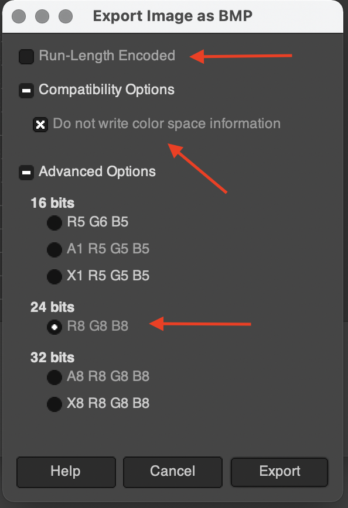

### `.WAV` files

These are standard `WAV` files used in Class 3 display firmware, but they need to have some specific properties.

The files you use must be mono signed integer PCM, with a 32 kHz sampling rate, a bit depth of 16 bits and a bit rate of 512k (16 bit * 32 kHz).
They should use a RIFF header (little endian) and NOT a RIFX header (big endian)

If you have some audio files you want to use, you can use tools like [`ffmpeg`](https://ffmpeg.org/) or [`sox`](http://sox.sourceforge.net/) to convert it to the right format.

The example below shows an exact `ffmpeg` command for creating a correctly formatted `WAV`:

```bash
ffmpeg -i input.mp3 -acodec pcm_s16le -ac 1 -ar 32000 output.wav
```

If you have `sox` installed, you can check whether the file if formatted coorrectly by running:

```bash
soxi file.WAV
```

Which should output something close to this:

```
Input File     : 'Other/DWIN_SET/8 starting3.WAV'
Channels       : 1
Sample Rate    : 32000
Precision      : 16-bit
Duration       : 00:00:02.51 = 80424 samples ~ 188.494 CDDA sectors
File Size      : 161k
Bit Rate       : 512k
Sample Encoding: 16-bit Signed Integer PCM
```

The channels, sample rate, precision and sample encoding fields should match exactly.

### Font .HZK tools

TODO: Add more info here.

We are in the process of developing some Python tools for handling these files. However, there is already a tool for handling these using Go: [Quint097's DWIN_Font_Tools package](https://github.com/Quint097/DWIN_Font_Tools). It includes Go code, plus precompiled `.exe` files and `.bat` files for running it on Windows.

### `.BIN` files

_NOTE: This section is very much a work in progress, and is being actively changed. It probably has typos and bad grammar._

These files are originally sourced from DWIN; at present we don't have any good techniques for changing them. There are some DWIN-provided tools for changing them, but they are specific to a single screen, are limited in their scope, and only run on Windows 10. If you want to try them out, check them out below:

* [For T5UIC1 screens (Class 1)](https://github.com/ihrapsa/T5UIC1-DWIN-toolset/tree/main/Dwin_Toolbox-en)
* [For T5L screens (Class 2)](http://dwin.com.cn/home/Index/download_file?download_id=4796)
* [For T5UID1 screens (Class 3)](http://pc-maniak.eu/DGUS_V7383.zip)

The big advantage of these tools is that you probably won't have any format issues, since they are built just to make these files for you.

However, most of the screens behavior is controlled via SPI from the mainboard, so these files don't really need to be changed. The notable exception is the screen orientation, which is kept inside the `.CFG` file for all screen types. We are developing a way of controlling/setting this value in the file.

#### Class 1 (T5UIC1 screens)

[This document from DWIN](https://github.com/ihrapsa/T5UIC1-DWIN-toolset/blob/main/T5UIC1.Kernel.Application.Guide-en-v2.3\(translated\).pdf) contains info on what each of the binary file types are:

* `T5UIC1.CFG` - hardware profile and configuration.
* `T5UIC1_*.BIN` - OS and kernel programs; "program upgrade file".

More info on the command interface for the display can be found in [this document](https://github.com/ihrapsa/T5UIC1-DWIN-toolset/blob/main/dwin-hmi-command-set-v2-amp-display-inc-leading-set-v24.pdf).

#### Class 2 (T5L screens)

[Link to a project re: building CR6 display firmware.](https://github.com/CR6Community/CR-6-touchscreen)
According to [this document](https://www.electroniclinic.com/wp-content/uploads/2020/11/T5L_DGUSII-Application-Development-Guide20200902-1.pdf) from DWIN, this is what each of the `.BIN` and `.CFG` files do in T5L screens:

* `T5L_UI*.BIN / T5L_OS*.BIN` - firmware kernel.
* `DWINOS*.BIN / T5L51*.BIN` - Operating system.
* `12*.BIN` - input method controls.
* `13*.BIN` - touch controls.
* `14*.BIN` - DGUS variables file.
* `22*.BIN` - DGUS variables initialization file.
* `T5LCFG*.CFG` - hardware configuration file. This file is described in great detail beginning on page 20 of that document, so we can conceivably build a tool to generate these, but that does not exist at present.

#### Class 3 (T5UID1 screens)

[Project for building CR10S firmware](https://github.com/PC-maniak/Creality-CR10S-PRO-DWIN)
[Other T5UID1 screens](https://github.com/Desuuuu/DGUS-reloaded)

We have not yet tracked down the documentation for this screen; the closest we've come is [this documentation for the T5UID2](https://iautomatyka.pl/wp-content/uploads/2020/01/T5UID2_Application_Guide.pdf).

FOUND: http://www.dwin.com.cn/home/Index/download_file?download_id=551
